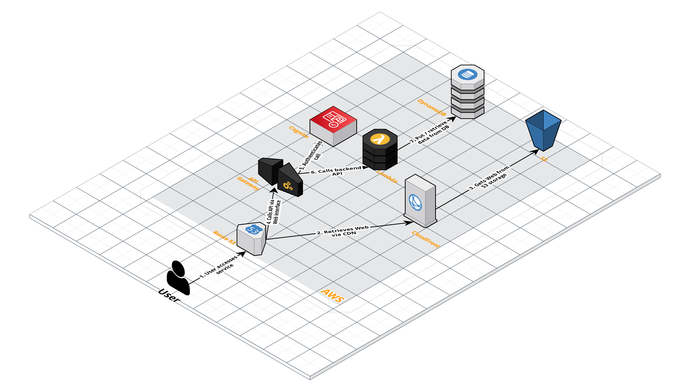

# Tamagotchi

Tamagotchi like fullstack web app. It is deployed [here](https://empowher.zone).
## Table of Contents

* [Description](#description)
* [Requirements](#requirements)
* [Development](#development)
  * [Installation](#installation)
  * [Running](#running)
    * [Web](#web)
    * [API](#api)
  * [Building](#building)
    * [Web](#web-1)
    * [API](#api-1)
  * [Linting](#linting)
    * [Web](#web-2)
    * [API](#api-2)
* [Infrastructure](#infrastructure)
  * [Architectural Diagram](#architectural-diagram)

# Description
This project is a full-stack application built with a React frontend, an Express.js API, and a DynamoDB database. The entire codebase is written in TypeScript and organized as a monorepo using Nx. The infrastructure is managed with AWS CDK, which sets up a Lambda function for the Express API, an HTTP API Gateway for the React website, and an S3 bucket with CloudFront for hosting the website.

The application is designed to provide a seamless user experience with a React-based frontend and a performant backend powered by Express.js and DynamoDB. The use of AWS services like Lambda, API Gateway, S3, and CloudFront ensures scalability and reliability. The project is structured as a monorepo using Nx, which allows for shared code and resources across the frontend and backend, such as the `lib/types` which is shared Typescript types of what the API request/response looks like with the website. AWS CDK is used for infrastructure management, providing an Infrastructure as Code (IaC) solution that I used for deployment.

# Requirements
- NodeJS
- npm
- AWS CLI
- AWS account

## Development
### Installation
1. Clone repository
```shell
git clone https://github.com/aleboarna/tamagotchi.git
```
2. Navigate to the project directory:
```shell
cd tamagotchi
```
3. Install dependencies
```shell
npm install
```

### Running
As we are using nx to give us pre-configured boilerplate for running the common commands that are configured in each individual subproject `project.json`,  the components can be run as follows:
#### Web
```shell
nx serve web
```
#### API
```shell
nx serve api
```

### Building
Build configuration is specified in the specific subproject `project.json`
#### Web
```shell
nx build web
```
#### API
For local development
```shell
nx build:express api
```
For lambda deployment as we want the entrypoint that exports the lambda handler function with the serverless express middleware.
```shell
nx build:lambda api
```

### Linting
Build configuration is specified in the specific subproject `project.json`
#### Web
```shell
nx lint web
```
#### API
```shell
nx lint api
```

## Infrastructure
### Architectural Diagram

